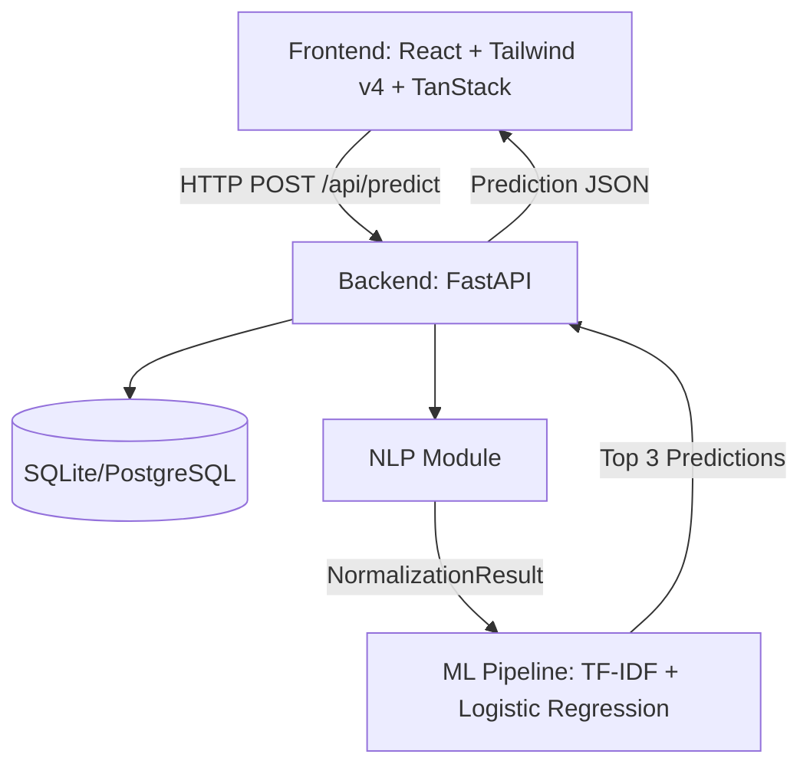
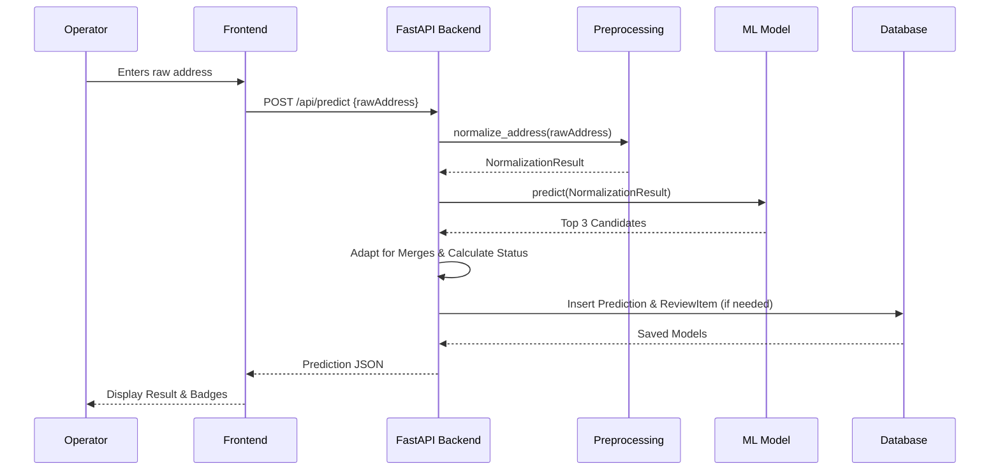
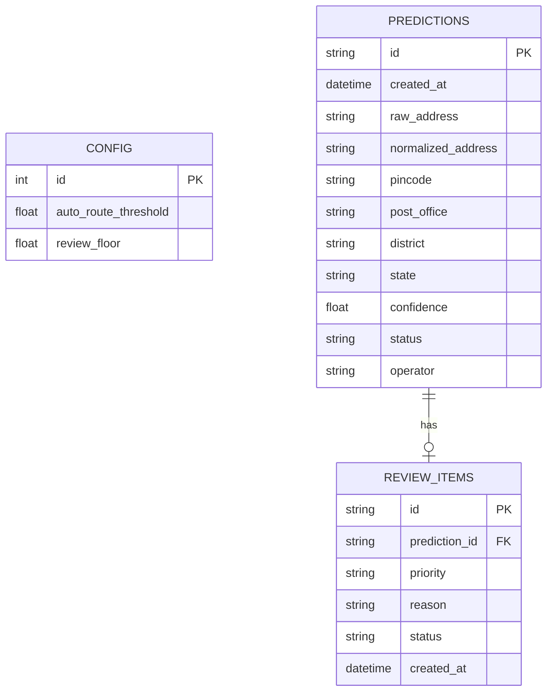

# PostRoute AI Architecture

## Overview
PostRoute AI is an AI-powered Delivery Post Office Identification System. It predicts the correct PIN code and delivery post office from incomplete or noisy Indian address text. It features a React-based frontend and a Python/FastAPI backend with a machine learning model.

---

## 1. System Architecture

---

## 2. API Flow

---

## 3. Entity Relationship Diagram (ERD)

