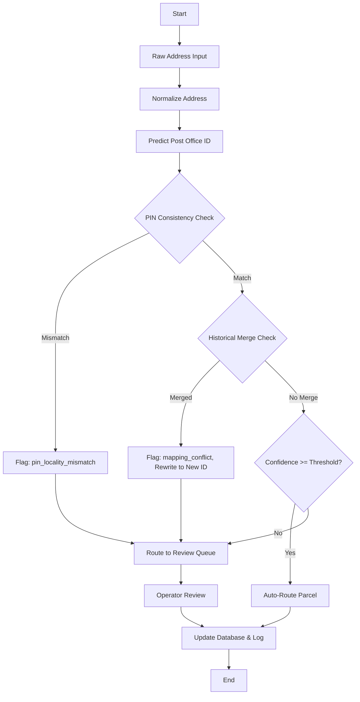

# Activity Diagram

```mermaid
flowchart TD
    A[Start] --> B[Raw Address Input]
    B --> C[Normalize Address]
    C --> D[Predict Post Office ID]
    D --> E{PIN Consistency Check}
    E -->|Mismatch| F[Flag: pin_locality_mismatch]
    E -->|Match| G{Historical Merge Check}
    G -->|Merged| H[Flag: mapping_conflict, Rewrite to New ID]
    G -->|No Merge| I{Confidence >= Threshold?}
    I -->|Yes| J[Auto-Route Parcel]
    I -->|No| K[Route to Review Queue]
    F --> K
    H --> K
    K --> L[Operator Review]
    L --> M[Update Database & Log]
    J --> M
    M --> N[End]
```
