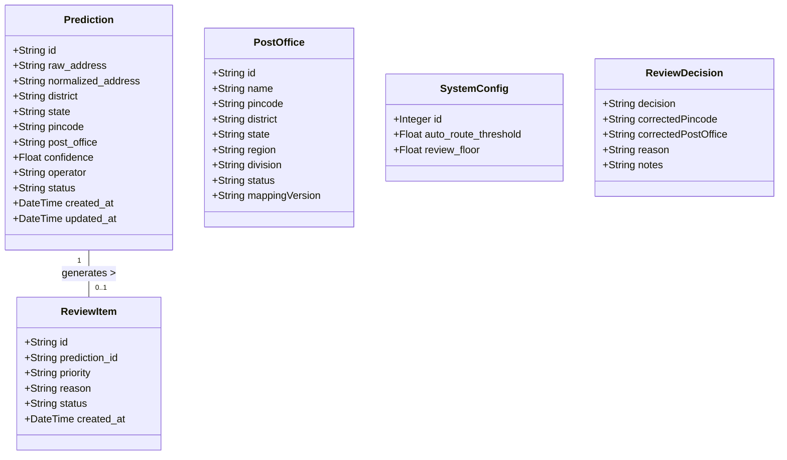

# Class Diagram

```mermaid
classDiagram
    class Prediction {
        +String id
        +String raw_address
        +String normalized_address
        +String district
        +String state
        +String pincode
        +String post_office
        +Float confidence
        +String operator
        +String status
        +DateTime created_at
        +DateTime updated_at
    }

    class ReviewItem {
        +String id
        +String prediction_id
        +String priority
        +String reason
        +String status
        +DateTime created_at
    }

    class PostOffice {
        +String id
        +String name
        +String pincode
        +String district
        +String state
        +String region
        +String division
        +String status
        +String mappingVersion
    }

    class SystemConfig {
        +Integer id
        +Float auto_route_threshold
        +Float review_floor
    }

    class ReviewDecision {
        +String decision
        +String correctedPincode
        +String correctedPostOffice
        +String reason
        +String notes
    }

    Prediction "1" -- "0..1" ReviewItem : generates >
```
