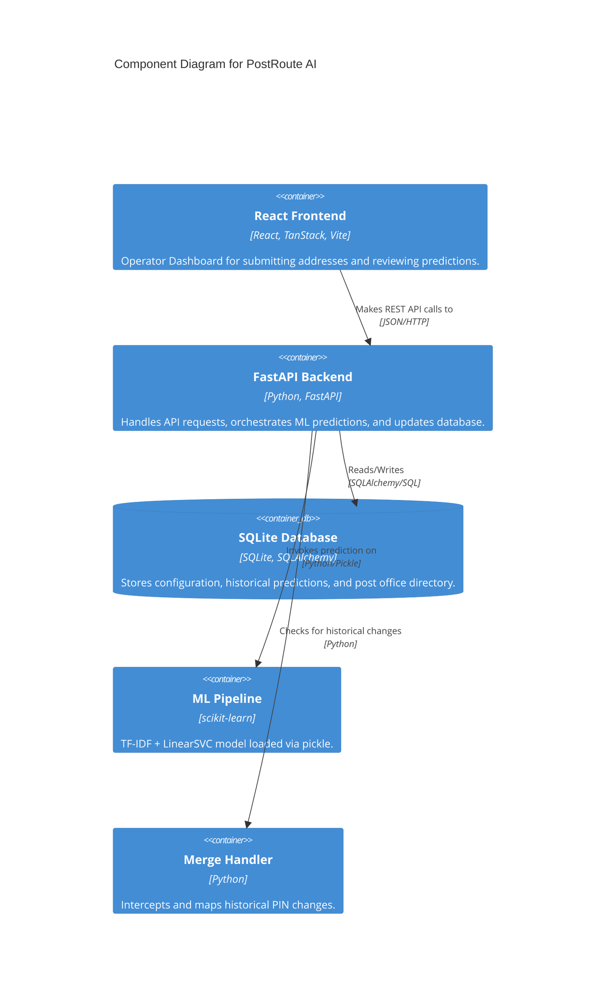

# Component & Deployment Diagram

```mermaid
C4Container
    title Component Diagram for PostRoute AI
    
    Container(react_ui, "React Frontend", "React, TanStack, Vite", "Operator Dashboard for submitting addresses and reviewing predictions.")
    Container(fastapi_backend, "FastAPI Backend", "Python, FastAPI", "Handles API requests, orchestrates ML predictions, and updates database.")
    ContainerDb(sqlite_db, "SQLite Database", "SQLite, SQLAlchemy", "Stores configuration, historical predictions, and post office directory.")
    Container(ml_pipeline, "ML Pipeline", "scikit-learn", "TF-IDF + LinearSVC model loaded via pickle.")
    Container(merge_handler, "Merge Handler", "Python", "Intercepts and maps historical PIN changes.")

    Rel(react_ui, fastapi_backend, "Makes REST API calls to", "JSON/HTTP")
    Rel(fastapi_backend, ml_pipeline, "Invokes prediction on", "Python/Pickle")
    Rel(fastapi_backend, merge_handler, "Checks for historical changes", "Python")
    Rel(fastapi_backend, sqlite_db, "Reads/Writes", "SQLAlchemy/SQL")
```
