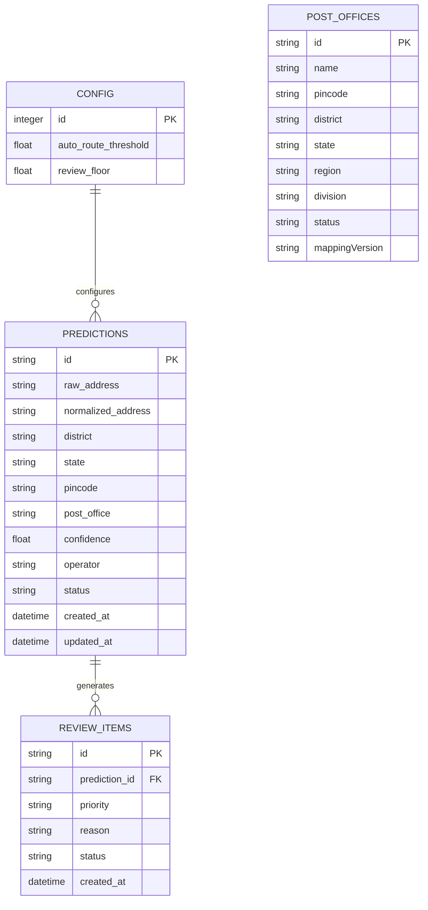

# ER Diagram

```mermaid
erDiagram
    PREDICTIONS ||--o{ REVIEW_ITEMS : generates
    CONFIG ||--o{ PREDICTIONS : configures

    PREDICTIONS {
        string id PK
        string raw_address
        string normalized_address
        string district
        string state
        string pincode
        string post_office
        float confidence
        string operator
        string status
        datetime created_at
        datetime updated_at
    }

    REVIEW_ITEMS {
        string id PK
        string prediction_id FK
        string priority
        string reason
        string status
        datetime created_at
    }

    POST_OFFICES {
        string id PK
        string name
        string pincode
        string district
        string state
        string region
        string division
        string status
        string mappingVersion
    }

    CONFIG {
        integer id PK
        float auto_route_threshold
        float review_floor
    }
```
