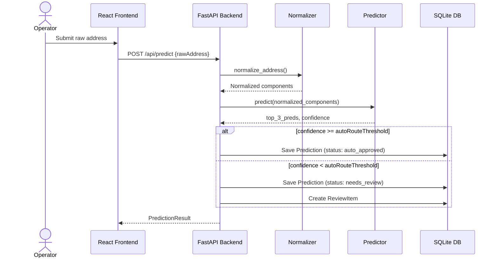
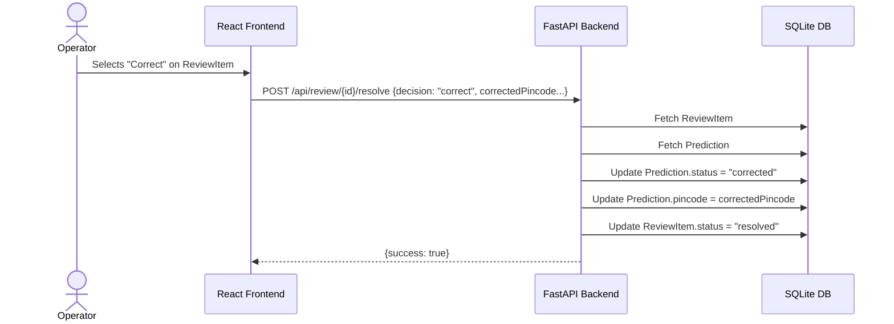

# Sequence Diagrams

## 1. Predict Flow

```mermaid
sequenceDiagram
    actor Operator
    participant UI as React Frontend
    participant API as FastAPI Backend
    participant NLP as Normalizer
    participant ML as Predictor
    participant DB as SQLite DB

    Operator->>UI: Submit raw address
    UI->>API: POST /api/predict {rawAddress}
    API->>NLP: normalize_address()
    NLP-->>API: Normalized components
    API->>ML: predict(normalized_components)
    ML-->>API: top_3_preds, confidence
    
    alt confidence >= autoRouteThreshold
        API->>DB: Save Prediction (status: auto_approved)
    else confidence < autoRouteThreshold
        API->>DB: Save Prediction (status: needs_review)
        API->>DB: Create ReviewItem
    end
    API-->>UI: PredictionResult
```

## 2. Review Decision Flow

```mermaid
sequenceDiagram
    actor Operator
    participant UI as React Frontend
    participant API as FastAPI Backend
    participant DB as SQLite DB

    Operator->>UI: Selects "Correct" on ReviewItem
    UI->>API: POST /api/review/{id}/resolve {decision: "correct", correctedPincode...}
    API->>DB: Fetch ReviewItem
    API->>DB: Fetch Prediction
    API->>DB: Update Prediction.status = "corrected"
    API->>DB: Update Prediction.pincode = correctedPincode
    API->>DB: Update ReviewItem.status = "resolved"
    API-->>UI: {success: true}
```
